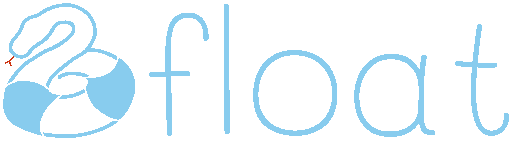

<p align="center">
  
</p>
<p align="center">
    <em>[Place for badges]</em>
</p>

<p align="center">
    <strong><em>float</em> (<u>f</u>riction<u>l</u>ess <u>o</u>nline model <u>a</u>nalysis and <u>t</u>esting)</strong> is a modular framework for standardized and high-quality evaluations of online learning methods.
    <br><em>float</em> can combine custom code with functionality of popular libraries and provides easy access to meaningful evaluation strategies, measures and visualisations.
</p>

>**Release Notes:**<br>
>*v0.0.1* - initial release.

## Installation
Install float with pip (NOTE for reviewers: the package is not available on pip yet):
```
pip install float
```
Alternatively, you may clone the repository from Github:
```
git clone git@github.com:haugjo/float.git
```

## Requirements
Float is supported by python versions >=3.7.x. 

Float requires the following packages (note that older versions have not been tested, but might also work):
- numpy~=1.21.2
- scikit-learn~=0.24.2
- tabulate~=0.8.5
- matplotlib~=3.4.2
- scipy~=1.6.2
- pytorch~=1.4.0 (only required by the CancelOut feature selector)

## Quickstart
Below, we show how to run a basic prequential evaluation in float. More extensive examples, 
including a use of the visualizer module, can be found in the ```./experiments``` folder.
```python
from skmultiflow.trees import HoeffdingTreeClassifier
from sklearn.metrics import zero_one_loss

from float.data import DataLoader
from float.prediction.evaluation import PredictionEvaluator
from float.prediction.evaluation.measures import noise_variability
from float.pipeline import PrequentialPipeline
from float.prediction.skmultiflow import SkmultiflowClassifier

# Load a data set from main memory with the DataLoader module.
data_loader = DataLoader(path='data/datasets/spambase.csv', target_col=-1)

# Set up an online classifier. Note, we need a wrapper to use scikit-multiflow functionality.
classifier = SkmultiflowClassifier(model=HoeffdingTreeClassifier(),
                                   classes=data_loader.stream.target_values)

# Set up an evaluation object for the classifier:
# Here, we want to measure the zero_one_loss and the noise_variability as an indication of robustness.
# The arguments of the measure functions can be directly added to the Evaluator object constructor,
# e.g. we may specify the number of samples (n_samples) used for the noise_variability measure.
evaluator = PredictionEvaluator(measure_funcs=[zero_one_loss, noise_variability], n_samples=15)

# Set up a pipeline for a prequential evaluation of the classifier.
pipeline = PrequentialPipeline(data_loader=data_loader,
                               predictor=classifier,
                               prediction_evaluator=evaluator,
                               n_max=data_loader.stream.n_samples,
                               batch_size=25)

# Run the experiment.
pipeline.run()
```
```console
Output:
Pretrain the predictor with 100 observation(s).
[====================] 100%
################################## SUMMARY ##################################
Evaluation has finished after 49.99301838874817s
Data Set data/datasets/spambase.csv
The pipeline has processed 4601 instances in total, using batches of size 25.
----------------------
Prediction:
| Model                   |   Avg. Test Comp. Time |   Avg. Train Comp. Time |   Avg. zero_one_loss |   Avg. noise_variability |
|-------------------------|------------------------|-------------------------|----------------------|--------------------------|
| HoeffdingTreeClassifier |              0.0169362 |               0.0290234 |             0.180552 |                 0.241901 |
#############################################################################
```

## References
Please refer to the following paper when using float: _Todo_

Please also make sure that you reference the corresponding papers, when using one of the provided implementations or data sets.

## Contribution
We welcome meaningful contributions by the community. In particular, we encourage contributions of new evaluation strategies, measures and data sets.

Additionally, we welcome implementations of novel online learning models (however, we discourage contributing models that are already included in one 
of the major libraries. Again, note that float is not primarily intended as a library of state-of-the-art online learning methods, but as a toolkit for their standardised evaluation.)

All contributed source code must adhere to the following criteria:
- Code must conform with the [PEP8](https://www.python.org/dev/peps/pep-0008/) standard.
- Docstrings must conform with the [Google docstring](https://google.github.io/styleguide/pyguide.html) convention.
- We will soon provide unit tests to validate any contribution before it is included in the package.

Please feel free to contact us, if you plan to make a contribution.
